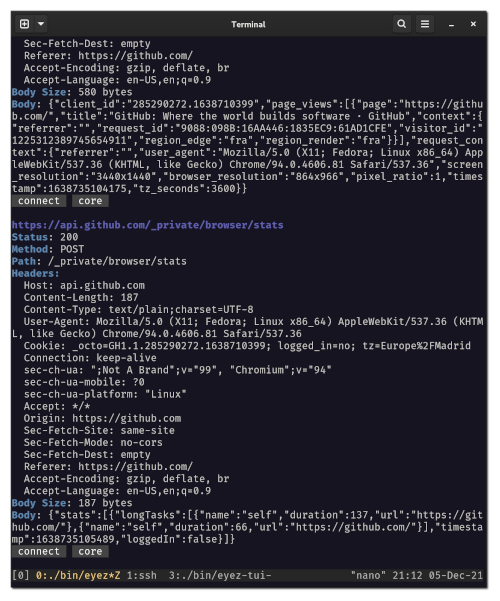

# eyeZ

HTTP proxy experiment powered by [bubbletea](https://github.com/charmbracelet) and (httransform)[github.com/9seconds/httransform]

## Features

* Terminal UI
* Database recording (similar to [hyperfox](https://github.com/malfunkt/hyperfox))

## Installation

```
# Proxy/Recorder
go install github.com/rubiojr/eyez/cmd/eyez@latest

# optional TUI Viewer
go install github.com/rubiojr/eyez/cmd/eyez-tui@latest
```

## Usage

Proxy:

```
eyez --port 1080 --db /path/to/sqlite.db
```

TUI Viewer

```
eyez-tui --db /path/to/sqlite.db
```

## Action shots

TUI Viewer


Record Screen

